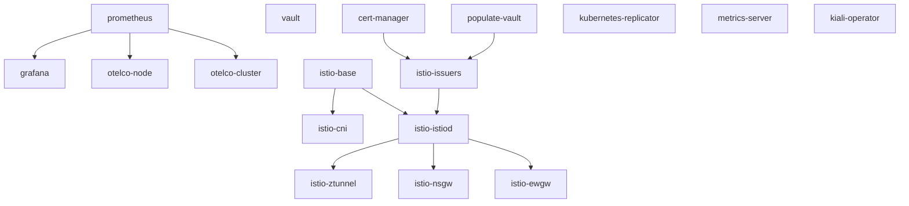

# Argo Workflows

[Argo Workflows](https://argo-workflows.readthedocs.io) is the orchestrator that
turns the pile of Argo CD `ApplicationSet`s into an ordered bootstrap. It is
installed by the `setup-argowf` section into the `argowf` namespace of the
manager cluster, with the controller scoped to the `argocd` namespace and
`DEFAULT_REQUEUE_TIME` lowered to `1s` so the DAG advances quickly.

- UI: <http://127.0.0.1:8081> (`admin` / `meshlab123`)

## WorkflowTemplates

`charts/wftemplates` provides the two reusable templates:

- `argocd-sync-and-wait` — syncs the Argo CD applications matching a label
  selector (`argocd app sync -l name=<app> --async`), then waits for the
  operation and for health.
- `populate-vault` — enables the `mesh` PKI in Vault, generates the root CA,
  writes the `mesh-cert-manager` policy and creates the AppRole cert-manager
  uses to sign intermediate CAs.

## The bootstrap DAG

The DAG itself is not a chart: it is generated inline by the `bootstrap-dag`
section of `bin/meshlab` and submitted with `argo submit`. Roughly:



`istio-ewgw` is only part of the DAG in `--network-mode multi`.

## Everyday commands

List the workflows:
```console
argo --context kind-mnger-1 -n argocd list
```

Follow the bootstrap workflow:
```console
argo --context kind-mnger-1 -n argocd logs -f @latest
argo --context kind-mnger-1 -n argocd get @latest
```

Re-run the whole bootstrap (idempotent — it is skipped if a `bootstrap-*`
workflow already exists):
```console
meshlab run bootstrap-dag
```
