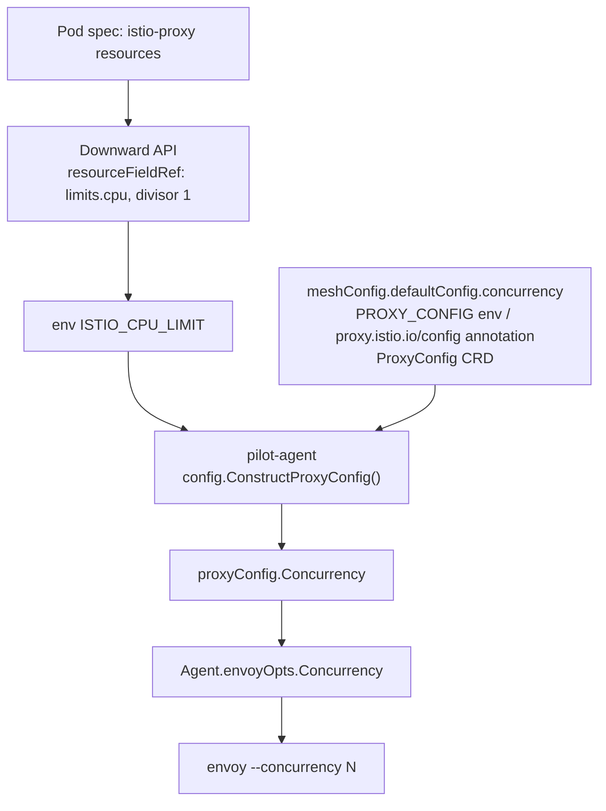

# Istio sidecar CPU sizing: no CPU limit, concurrency and `GOMAXPROCS`

Investigation of the proposed policy:

```text
proxy CPU request  = R
CPU limit          = none
Envoy concurrency  = max(1, floor(R) - 1)
pilot-agent GOMAXPROCS = 1
```

All code references are against the `istio` checkout in this workspace
(branch `1.30.4`, `go.mod` declares `go 1.25.9`), with upstream `master`
deltas called out where they matter.

---

## TL;DR

- **The single biggest incorrect assumption in the proposal is that
  "no CPU limit" means "Istio does not derive anything from a limit".**
  It does. The injection template feeds `limits.cpu` through the
  Kubernetes downward API, and the kubelet **substitutes node allocatable
  CPU when no limit is set**. On a 64-core node with no CPU limit you get
  `ISTIO_CPU_LIMIT=64` → `--concurrency 64`, and (on 1.30) `GOMAXPROCS=64`.
  This is a hard failure of the design unless concurrency is set explicitly.
  **This is not theoretical — it is already happening in meshlab today; see
  [§9](#9-empirical-verification-meshlab-kind-pasta-1).**
- **Istio never looks at the CPU request.** Not in `pilot-agent`, not in
  the injection template, not in `mesh config`. `requests.cpu` appears
  nowhere in the proxy configuration path. It was removed in Istio 1.18
  (PR #43865).
- Setting `meshConfig.defaultConfig.concurrency` (or the per-pod
  `proxy.istio.io/config` annotation) is **mandatory** for the "no CPU
  limit" model, and is exactly what upstream recommends
  ([#51456](https://github.com/istio/istio/issues/51456)).
- `GOMAXPROCS=1` for `pilot-agent` is **technically safe but not the value
  I would pick.** The agent's hot path (xDS proxying) is a
  marshal/unmarshal pipeline split across two goroutines; `GOMAXPROCS=1`
  serialises them and roughly doubles worst-case forwarding latency during
  large pushes. `GOMAXPROCS=2` costs nothing and removes that cliff.
- `floor(R) - 1` is defensible on large requests but **breaks badly at the
  small end** (`50m`, `500m`, `1`, `2` CPU) where it collapses to 1 and
  gives you a single-worker Envoy. `max(1, round(R))` with an explicit
  floor of 2 is a better default.
- **`GOMAXPROCS=1` does not reserve CPU for Envoy.** It caps Go-level
  parallelism only. Envoy's worker threads are ordinary OS threads in the
  same cgroup competing on equal footing; reducing concurrency by one does
  not create a reserved core.

---

## 1. How Envoy concurrency is determined today

### 1.1 The chain



### 1.2 Injection template

[manifests/charts/istio-control/istio-discovery/files/injection-template.yaml](../../istio/manifests/charts/istio-control/istio-discovery/files/injection-template.yaml#L270-L274):

```yaml
    - name: ISTIO_CPU_LIMIT
      valueFrom:
        resourceFieldRef:
          resource: limits.cpu
          divisor: "1"
```

and [lines 293-302](../../istio/manifests/charts/istio-control/istio-discovery/files/injection-template.yaml#L293-L302):

```yaml
    - name: GOMEMLIMIT
      valueFrom:
        resourceFieldRef:
          resource: limits.memory
          divisor: "1"
    - name: GOMAXPROCS
      valueFrom:
        resourceFieldRef:
          resource: limits.cpu
          divisor: "1"
```

The `resources` block itself is the `"resources"` template at
[lines 1-27](../../istio/manifests/charts/istio-control/istio-discovery/files/injection-template.yaml#L1-L27),
which maps `sidecar.istio.io/proxyCPU` → `requests.cpu` and
`sidecar.istio.io/proxyCPULimit` → `limits.cpu`. **The request is written
into the pod spec and then never read again by Istio.**

`ISTIO_CPU_LIMIT` and `GOMAXPROCS` come from the same downward-API source
but are injected by **overlapping, not identical, sets of templates**:

| Template | `ISTIO_CPU_LIMIT` | `GOMAXPROCS` |
| --- | :---: | :---: |
| `istio-discovery/files/injection-template.yaml` (sidecar) | ✅ L270 | ✅ L298 |
| `istio-discovery/files/gateway-injection-template.yaml` | ✅ L87 | ✅ L113 |
| `istio-discovery/files/kube-gateway.yaml` | ✅ L168 | ✅ L185 |
| `istio-discovery/files/waypoint.yaml` | ✅ L165 | ✅ L184 |
| `gateways/istio-ingress/templates/deployment.yaml` | ✅ L175 | ❌ |
| `gateways/istio-egress/templates/deployment.yaml` | ✅ L175 | ❌ |
| `istio-discovery/templates/deployment.yaml` (istiod) | ❌ | ✅ L220 |
| `istio-cni/templates/daemonset.yaml` | ❌ | ✅ L189 |

That is the complete set — six producers of `ISTIO_CPU_LIMIT`, six of
`GOMAXPROCS`, four in common. istiod and the CNI agent get `GOMAXPROCS`
only, because they never launch Envoy; the legacy in-mesh gateway charts get
`ISTIO_CPU_LIMIT` only.

### 1.3 `pilot-agent`

[pilot/cmd/pilot-agent/config/config.go](../../istio/pilot/cmd/pilot-agent/config/config.go#L62-L83):

```go
	// Concurrency wasn't explicitly set
	if proxyConfig.Concurrency == nil {
		// We want to detect based on CPU limit configured. If we are running on a 100 core machine, but with
		// only 2 CPUs allocated, we want to have 2 threads, not 100, or we will get excessively throttled.
		if CPULimit != 0 {
			log.Infof("cpu limit detected as %v, setting concurrency", CPULimit)
			proxyConfig.Concurrency = wrapperspb.Int32(int32(CPULimit))
		}
	}
	// Respect the old flag, if they set it. This should never be set in typical installation.
	if concurrency != 0 {
		log.Warnf("legacy --concurrency=%d flag detected; prefer to use ProxyConfig", concurrency)
		proxyConfig.Concurrency = wrapperspb.Int32(int32(concurrency))
	}

	if proxyConfig.Concurrency.GetValue() == 0 {
		if CPULimit < runtime.NumCPU() {
			log.Warnf("concurrency is set to 0, which will use a thread per CPU on the host. However, CPU limit is set lower. "+
				"This is not recommended and may lead to performance issues. "+
				"CPU count: %d, CPU Limit: %d.", runtime.NumCPU(), CPULimit)
		}
	}
```

and [line 179](../../istio/pilot/cmd/pilot-agent/config/config.go#L179-L183):

```go
var CPULimit = env.Register(
	"ISTIO_CPU_LIMIT",
	0,
	"CPU limit for the current process. Expressed as an integer value, rounded up.",
).Get()
```

Precedence, highest first:

1. legacy `--concurrency` flag (deprecated, warns)
2. explicit `ProxyConfig.Concurrency` (mesh config / `PROXY_CONFIG` env /
   `proxy.istio.io/config` annotation / `ProxyConfig` CRD)
3. `ISTIO_CPU_LIMIT`
4. nothing → `--concurrency` is not passed at all

Note `mesh.DefaultProxyConfig()` leaves `Concurrency` **nil** — there is no
built-in default of 2 any more. `pkg/kube/inject/template.go` even strips it
back to nil when it equals the default
([template.go:352](../../istio/pkg/kube/inject/template.go#L352-L354)).

### 1.4 Handoff to Envoy

[pkg/istio-agent/agent.go:330](../../istio/pkg/istio-agent/agent.go#L330):

```go
	a.envoyOpts.Concurrency = a.proxyConfig.Concurrency.GetValue()
```

[pkg/envoy/proxy.go:168-170](../../istio/pkg/envoy/proxy.go#L168-L170):

```go
	if e.Concurrency > 0 {
		startupArgs = append(startupArgs, "--concurrency", fmt.Sprint(e.Concurrency))
	}
```

### 1.5 What happens when `concurrency` is unset

`--concurrency` is simply **not passed**, and Envoy falls back to its own
default: `std::thread::hardware_concurrency()`, i.e. every logical CPU on
the **node**. On a 64-core node that is 64 worker threads, each with its own
copy of the listener/cluster/route data structures. This is the
"crazy amount of memory and no performance benefit" that howardjohn warns
about in [#51456](https://github.com/istio/istio/issues/51456#issuecomment-2155220061).

### 1.6 **CPU request but no CPU limit — the critical case**

This is where the proposal is wrong.

`resourceFieldRef` on `limits.cpu` does **not** produce an empty value when
no limit is set. From the Kubernetes
[Downward API docs](https://kubernetes.io/docs/concepts/workloads/pods/downward-api/):

> **Fallback information for resource limits** — If CPU and memory limits
> are not specified for a container, and you use the downward API to try to
> expose that information, then the kubelet defaults to exposing the maximum
> allocatable value for CPU and memory based on the node allocatable
> calculation.

So with `sidecar.istio.io/proxyCPU: "4"` and no `proxyCPULimit`, on a
64-core node:

| Variable | Value |
| --- | --- |
| `ISTIO_CPU_LIMIT` | `64` (node allocatable, rounded up) |
| `proxyConfig.Concurrency` | `64` |
| Envoy startup args | `--concurrency 64` |
| `GOMAXPROCS` (1.30 and earlier) | `64` |

That is the *worst* outcome — worse than leaving concurrency unset, because
it is silently and confidently wrong, and it is not visible anywhere except
an `Infof` log line: `cpu limit detected as 64, setting concurrency`.

The test fixture
[pkg/kube/inject/testdata/inject/traffic-annotations.yaml](../../istio/pkg/kube/inject/testdata/inject/traffic-annotations.yaml#L13-L14)
still carries a stale comment ("We set 4 CPUs here and concurrency=0 below.
Expect concurrency to be set to 4") from the pre-1.18 behaviour; the
`.injected` golden shows only `requests.cpu: "4"` and no limits, so at
runtime that pod would get node-allocatable concurrency, not 4.

### 1.7 History: Istio *used* to use the request

Before Istio 1.18, concurrency was computed at **injection time** in
`pkg/kube/inject/inject.go`, and it did fall back to the request
(`git show 97baf44e71`):

```go
		if limit, ok := annotations[annotation.SidecarProxyCPULimit.Name]; ok {
			out, err := quantityToConcurrency(limit)
			...
		} else if request, ok := annotations[annotation.SidecarProxyCPU.Name]; ok {
			out, err := quantityToConcurrency(request)
			...
		}
		...
	return 2
```

with `quantityToConcurrency` = `ceil(millicores / 1000)`. PR
[#43865](https://github.com/istio/istio/pull/43865) ("Fix proxy concurrency
detection", Istio 1.18) deleted this and moved detection into the agent,
limit-only. Its release note is explicit:

> The new logic will use the `ProxyConfig.Concurrency` setting … if set, and
> otherwise set concurrency based on the **CPU limit** allocated to the
> container. … To retain the old gateway behavior of always utilizing all
> cores, `proxy.istio.io/config: concurrency: 0` can be set … However, it is
> recommended to instead **unset CPU limits** if this is desired.

So "derive concurrency from the request" is a **regression of behaviour that
upstream deliberately removed**, not a new idea.

---

## 2. How `GOMAXPROCS` is determined for `pilot-agent`

### 2.1 Explicit setting

- **Istio 1.30 (this checkout):** yes — the injection template sets
  `GOMAXPROCS` from `limits.cpu` via the downward API (see §1.2). Introduced
  in [PR #46253](https://github.com/istio/istio/pull/46253) "Set GOMAXPROCS
  and GOMEMLIMIT" (2023), motivated by
  [#41351](https://github.com/istio/istio/issues/41351) and
  [#20264](https://github.com/istio/istio/issues/20264).
- **Istio master (post-1.30):** **no** — issue
  [#60235](https://github.com/istio/istio/issues/60235) "Do not set
  GOMAXPROCS in Istio charts" was closed by
  [PR #60755](https://github.com/istio/istio/pull/60755), which removes the
  `GOMAXPROCS` env var from `injection-template.yaml`,
  `gateway-injection-template.yaml`, `kube-gateway.yaml`, `waypoint.yaml`,
  `istio-cni/templates/daemonset.yaml` and `istio-discovery/templates/deployment.yaml`.
  `ISTIO_CPU_LIMIT` and `GOMEMLIMIT` are **untouched** by that PR.

### 2.2 `automaxprocs`?

No. `go.uber.org/automaxprocs` appears **nowhere** in `go.mod` or `go.sum`.
The only `runtime.GOMAXPROCS(0)` *reads* in non-test code are:

- [pilot/pkg/features/tuning.go:49,68](../../istio/pilot/pkg/features/tuning.go#L45-L70)
  — istiod-side `PILOT_PUSH_THROTTLE` and `PILOT_MAX_REQUESTS_PER_SECOND`
  heuristics.
- [pkg/queue/delay.go:121](../../istio/pkg/queue/delay.go#L121)

Nothing in `pilot-agent` ever calls `runtime.GOMAXPROCS(n)` to set it, and
nothing in `pkg/istio-agent` reads `/sys/fs/cgroup`.

### 2.3 Go version and container awareness

`go.mod` declares `go 1.25.9`. Go 1.25 shipped
[container-aware `GOMAXPROCS`](https://go.dev/blog/container-aware-gomaxprocs),
gated on the `go` directive being ≥ 1.25.0 — which Istio satisfies. The
semantics:

- `GOMAXPROCS` defaults to the **cgroup CPU bandwidth limit** (`cpu.max`
  quota/period) if it is lower than the core count, rounded **up**.
- It is re-checked periodically and adjusts if the limit changes.
- Explicitly setting the `GOMAXPROCS` env var or calling
  `runtime.GOMAXPROCS` disables both behaviours.
- **CPU requests are explicitly out of scope.** From the same post:

  > Go's new `GOMAXPROCS` default is based on the container's CPU limit …
  > Unfortunately, this means that Go cannot set `GOMAXPROCS` based on the
  > CPU request … Containers with a CPU request are still constrained when
  > exceeding their request if the machine is busy. The weight-based
  > constraint … is "softer" than the hard period-based throttling of CPU
  > limits, but CPU spikes from high `GOMAXPROCS` can still have an adverse
  > impact.

  And, directly relevant here:

  > For example, a small container receiving 2 CPUs running on a 128 core
  > machine. These are the cases where it is most valuable to consider
  > setting an explicit CPU limit, or, alternatively, explicitly setting
  > `GOMAXPROCS`.

### 2.4 So what value does `pilot-agent` actually get on a 64-core node with no CPU limit?

| Istio version | Mechanism | Result |
| --- | --- | --- |
| ≤ 1.30 | chart sets `GOMAXPROCS` from `limits.cpu` (downward API fallback = node allocatable) | **64** |
| master (post-#60755) | Go 1.25 runtime reads cgroup `cpu.max` → `max` (no quota) → falls back to `runtime.NumCPU()` | **64** |

Either way: **64**. The CPU request (`cpu.weight` / `cpu.shares` in the
cgroup) is invisible to both mechanisms. The user's concern here is
correct — this is a real problem, and it is the strongest argument in the
whole proposal.

Note the same applies to `GOMEMLIMIT`, which the chart sets from
`limits.memory`; with no memory limit it becomes node-allocatable memory,
effectively disabling the Go soft memory limit (cf.
[#54174](https://github.com/istio/istio/issues/54174)).

---

## 3. Is `GOMAXPROCS=1` safe for `pilot-agent`?

Short answer: **safe, but leaves a latency cliff on the table. Prefer 2.**

### 3.1 What `pilot-agent` actually does

`pilot-agent` is deliberately thin. Its responsibilities, from
[pkg/istio-agent/agent.go](../../istio/pkg/istio-agent/agent.go):

| Responsibility | CPU character |
| --- | --- |
| xDS proxy (istiod ⇄ Envoy over UDS) | **dominant**; proto unmarshal + re-marshal per push |
| SDS server (workload + root certs) | bursty: RSA-2048 keygen + CSR at rotation |
| CA client (gRPC + mTLS to istiod:15012) | TLS handshake, infrequent |
| Local DNS proxy (`pkg/dns/client`) | small per-query, **latency sensitive** |
| Status/readiness server + metrics merge | `io.Copy` streaming, cheap |
| Health checking (VM/app probes) | negligible |
| File watchers (cert files) | negligible |
| Wasm module fetch/cache (ECDS) | rare, off the main loop (`go p.rewriteAndForward`) |

### 3.2 The xDS hot path

[pkg/istio-agent/xds_proxy.go](../../istio/pkg/istio-agent/xds_proxy.go) is
a straightforward relay. The important structural detail is that receive and
send run in **different goroutines**:

- `handleUpstream` spawns a goroutine that loops on `con.upstream.Recv()` —
  this is where gRPC **unmarshals** each `DiscoveryResponse` from istiod.
- `handleUpstreamResponse` (line 474) consumes `con.responsesChan` and calls
  `forwardToEnvoy` → `sendDownstream` → `downstream.Send(response)` — this is
  where gRPC **re-marshals** the same proto to the UDS stream.

For a large LDS/CDS/EDS push (tens of MB of proto in a big mesh) this is a
genuine multi-hundred-millisecond CPU burst, and it is paid **twice**
(unmarshal + marshal). With `GOMAXPROCS≥2` the unmarshal of push *N+1* can
overlap the marshal of push *N*. With `GOMAXPROCS=1` they serialise.

There is even an in-tree acknowledgement of this cost:

```go
// TODO: separate upstream response handling from requests sending, which are both time costly
```

and a latency canary in `sendDownstream`:

```go
		if time.Since(tStart) > 10*time.Second {
			proxyLog.Warnf("sendDownstream took %v", time.Since(tStart))
		}
```

Beyond that pipelining, there is **no data parallelism** in the agent — no
worker pools, no parallel resource processing. So `GOMAXPROCS=1` costs you
pipelining and GC concurrency, not fan-out.

### 3.3 The other paths under `GOMAXPROCS=1`

- **SDS / cert rotation.** Default workload key is **RSA-2048**
  (`WORKLOAD_RSA_KEY_SIZE=2048`,
  [options.go:88-93](../../istio/pilot/cmd/pilot-agent/options/options.go#L88-L93);
  `ECC_SIGNATURE_ALGORITHM` defaults to empty). `rsa.GenerateKey` is
  single-threaded regardless of `GOMAXPROCS`, so the *generation* is
  unaffected — but at `GOMAXPROCS=1` it blocks everything else in the agent
  for its duration. This happens on startup and at ~80% of cert TTL, so it
  is rare, but it is on the pod's startup critical path. If this matters,
  set `ECC_SIGNATURE_ALGORITHM=ECDSA` (P-256), which is orders of magnitude
  cheaper.
- **DNS proxy.** Each query is cheap, but at `GOMAXPROCS=1` a DNS query
  arriving mid-push queues behind the xDS marshal. For a sidecar doing
  heavy DNS this is the most user-visible risk of `GOMAXPROCS=1`.
- **Status server / readiness.** `/stats/prometheus` merging is `io.Copy`
  ([status/server.go:598-620](../../istio/pilot/cmd/pilot-agent/status/server.go#L598-L620)),
  so it is I/O-bound. But the readiness endpoint shares the same runtime; a
  long stop-the-world-ish stall could in principle push a readiness probe
  over its timeout.
- **GC.** At `GOMAXPROCS=1` the Go GC gets one dedicated mark worker and
  25% assist pressure lands on the single P. The agent's allocation rate is
  dominated by xDS proto churn, so this compounds §3.2.

### 3.4 Verdict

`GOMAXPROCS=1` will not break correctness anywhere. It is a reasonable
*guard* against runaway parallelism on a big node. But `GOMAXPROCS=2`:

- restores recv/send pipelining on the xDS path,
- keeps a second P available for the DNS proxy and readiness during a push,
- gives the GC somewhere to run that isn't the critical goroutine,
- and still bounds Go parallelism to a tiny, predictable number.

The marginal cost of `2` over `1` is essentially zero (an extra OS thread).
I would default to **2**, and only use **1** for very small sidecars
(`R ≤ 500m`).

---

## 4. CPU relationship between `pilot-agent` and Envoy

### 4.1 Same container, same cgroup — confirmed

`pilot-agent` is the container entrypoint and **forks Envoy as a child
process**:

[pkg/envoy/proxy.go:205-222](../../istio/pkg/envoy/proxy.go#L205-L222):

```go
func (e *envoy) Run(abort <-chan error) error {
	...
	cmd := exec.Command(e.BinaryPath, args...)
```

Two processes, one container, therefore **one cgroup**. All accounting
(`cpu.max`, `cpu.weight`, `cpu.stat` throttling counters) is shared. There
is no per-process CPU accounting or reservation.

### 4.2 Can you reserve CPU between them?

**Not without separating them into different containers.** Options and why
they don't apply:

| Mechanism | Applicable? |
| --- | --- |
| Kubernetes `resources` | Per-container only. Both processes are in `istio-proxy`. |
| cgroup sub-hierarchy | Would require the agent to create and move itself/Envoy into child cgroups. The container's cgroup is typically read-only to the workload; nothing in Istio does this. |
| `nice` / `sched_setscheduler` | Would change *relative priority* under contention, not reservation. Istio does not do this and does not expose a knob. |
| CPU pinning / `taskset` / Envoy `--cpuset-threads` | Requires `cpuset` cgroup support and static CPU manager policy; Istio never passes `--cpuset-threads`. |
| `GOMAXPROCS` | Caps Go parallelism only (see below). |

### 4.3 What `GOMAXPROCS=1` does and does not guarantee

**Does:**

- Caps the number of OS threads simultaneously running **Go** goroutines to
  1. This bounds the agent's *peak* CPU consumption from Go code to ~1 core.
- Reduces the agent's thread count and scheduler footprint.
- Makes the agent's CPU usage predictable and independent of node size.

**Does not:**

- **Reserve** any CPU for `pilot-agent`. If Envoy's workers saturate the
  cgroup, the agent's single P still competes for runtime like any other
  thread.
- Cap total agent CPU to 1 core. Goroutines blocked in cgo or syscalls do
  not consume a P; the Go runtime will spin up additional threads.
  `GOMAXPROCS` bounds Go-code parallelism, not process CPU time.
- Prevent Envoy from using more than `concurrency` cores — Envoy has a main
  thread, a guard dog thread, and various auxiliary threads on top of its
  `N` workers.
- Do anything about the *reverse* direction: it protects Envoy from the
  agent, not the agent from Envoy.

---

## 5. Evaluating `max(1, floor(cpu_request) - 1)`

### 5.1 The Linux scheduling reality

The premise "reserve a core for `pilot-agent` by giving Envoy one fewer
worker" does not hold as stated. Under CFS/EEVDF with **no CPU limit**:

- All threads in the container are peers in one cgroup with a single
  `cpu.weight` derived from the CPU **request**.
- If the node is idle, `N` Envoy workers will happily run on `N` cores and
  the agent will get scheduled too — total usage exceeds `R`, which is the
  intended burst behaviour.
- If the node is busy, the cgroup is entitled to roughly its weight share.
  Whether that share goes to Envoy workers or to the agent is decided by
  the scheduler's per-thread fairness, **not** by how many workers Envoy
  has. `N-1` busy Envoy workers plus a busy agent thread will each get
  roughly `share/N`, exactly as `N` workers plus an agent would get
  `share/(N+1)`.

So reducing concurrency by one does **not** carve out a core. What it
actually buys you is different, and still worthwhile:

1. **Fewer runnable threads competing** → the agent's single thread is a
   larger fraction of the runqueue, so it gets a proportionally larger
   share. `1/(N-1+1)` vs `1/(N+1)`. At `R=4` that's 25% vs 20% — real, but
   modest.
2. **Lower memory.** Every Envoy worker duplicates per-worker listener,
   cluster manager, and connection-pool state. This is often the larger win
   and is the reason upstream pushes back on high concurrency
   ([#51456](https://github.com/istio/istio/issues/51456#issuecomment-2155220061)).
3. **Less lock/atomic contention** in Envoy's cross-thread state
   propagation during xDS updates.

### 5.2 Can Envoy workers saturate everything anyway?

Yes. Envoy worker threads are event loops that will run at 100% if there is
work. `N-1` workers on a 4-CPU-request container with no limit can consume
3 full cores *plus* Envoy's main thread doing xDS ingestion, which during a
config storm is itself CPU-heavy and is *not* one of the `N` workers. So the
"minus one" does not protect the agent from the thing the user is actually
worried about — a config storm — because during a config storm the
contention is Envoy's **main thread** (config ingestion) versus the agent,
not the workers.

### 5.3 Behaviour at small requests

| `R` | `floor(R) - 1` | `max(1, floor(R)-1)` | `round(R)` | Assessment |
| --- | --- | --- | --- | --- |
| `50m` | `-1` | **1** | 1 | Fine, but a 50m sidecar with a real workload will throttle-free-but-starve regardless. |
| `100m` (Istio default request) | `-1` | **1** | 1 | Same. |
| `500m` | `-1` | **1** | 1 (`ceil`→1) | Fine. |
| `1` | `0` | **1** | 1 | Fine. |
| `2` | `1` | **1** | 2 | **Bad.** Halves throughput vs. today's default (limit 2000m → concurrency 2). Most sidecars live here. |
| `2500m` | `1` | **1** | 3 (`ceil`) / 2 (`round`) | **Bad.** Big regression. |
| `4` | `3` | **3** | 4 | Reasonable. |
| `8` | `7` | **7** | 8 | Reasonable. |

The `-1` term is a **fixed** subtraction applied to a **multiplicative**
resource. At `R=2` it removes 50% of the workers; at `R=8` it removes 12.5%.
That is the wrong shape. If you want headroom proportional to the sidecar
size, `-1` is not it; if you want a fixed reservation, you should express it
as a fixed reservation and floor the result at a sane minimum.

Also note the default Istio sidecar today is `requests 100m / limits 2000m`
([values.yaml:399-405](../../istio/manifests/charts/istio-control/istio-discovery/values.yaml#L399-L405))
→ concurrency 2. Any policy that produces 1 for the common case is a
throughput regression relative to the status quo.

### 5.4 Known Envoy / Istio assumptions

- Envoy's own default is one worker per logical CPU; there is **no** upstream
  Envoy recommendation to subtract a core for the main thread.
- Istio's performance benchmarks and published sizing guidance are all
  expressed against `concurrency: 2`.
- `concurrency: 0` is a special value meaning "one thread per host CPU" and
  is validated as ≥ 0
  ([validation.go:3198-3201](../../istio/pkg/config/validation/validation.go#L3198-L3201)).
  Do not accidentally produce 0.
- Istio Ambient's ztunnel is a separate discussion — none of this applies
  there.

---

## 6. Prior art in upstream Istio

| Ref | Relevance |
| --- | --- |
| [#43865](https://github.com/istio/istio/pull/43865) (1.18) | Moved concurrency detection from injection-time to `pilot-agent`; **removed** the CPU-request fallback; introduced `ISTIO_CPU_LIMIT`. |
| [#48793](https://github.com/istio/istio/pull/48793) | Added the `concurrency is set to 0 … CPU limit is set lower` warning. |
| [#51456](https://github.com/istio/istio/issues/51456) | "Ability to disable proxy CPU limits". howardjohn: *"By default, the number of threads Envoy uses is based on `min(CPU limit, num cores on the machine)`. Imagine you run a 256 core machine and no limit — it will use 256 threads … You can explicitly control it, but then you would end up with, say, 2 threads."* Reporter's conclusion: lock `concurrency: 2` and remove limits. **This is the sanctioned pattern.** |
| [#40078](https://github.com/istio/istio/issues/40078) | "Disable Default CPU Limits for Istio Proxy". |
| [#35905](https://github.com/istio/istio/issues/35905) | `sidecar.istio.io/proxyCPU` annotation erases resource limits (the `"resources"` template is all-or-nothing). |
| [#41351](https://github.com/istio/istio/issues/41351) | "pilot agent and istiod … needs to set GOMAXPROCS to ~ cpu request/limit" — the original motivation for #46253. |
| [#20264](https://github.com/istio/istio/issues/20264) | "Pilot gets cpu throttled because GOMAXPROCS not set". |
| [#46253](https://github.com/istio/istio/pull/46253) (1.19) | Added `GOMAXPROCS` + `GOMEMLIMIT` from `limits.*` to all charts. |
| [#54174](https://github.com/istio/istio/issues/54174) | `GOMEMLIMIT` misuse causing OOMKills — same downward-API-fallback class of bug. |
| [#60235](https://github.com/istio/istio/issues/60235) / [#60755](https://github.com/istio/istio/pull/60755) | **Removes `GOMAXPROCS` from all charts** in favour of Go 1.25 container-aware defaults. Merged to master, post-1.30. Explicitly motivated by "it is not possible for users to specify a value for `GOMAXPROCS` themselves". |

Nothing upstream currently derives anything from `requests.cpu`, and there
is no open proposal to do so.

---

## 7. What would need to change to implement the proposed policy

### 7.1 Achievable today, no code changes

| Goal | How |
| --- | --- |
| No CPU limit on the sidecar | Set `sidecar.istio.io/proxyCPU` only, and ensure `global.proxy.resources.limits` is unset. Careful: the `"resources"` template is all-or-nothing — if *any* of the four annotations is set, `global.proxy.resources` is ignored entirely ([injection-template.yaml:1-27](../../istio/manifests/charts/istio-control/istio-discovery/files/injection-template.yaml#L1-L27), cf. [#35905](https://github.com/istio/istio/issues/35905)). |
| Pin Envoy concurrency | `meshConfig.defaultConfig.concurrency: N` mesh-wide, or per-pod `proxy.istio.io/config: '{"concurrency": N}'`, or a `ProxyConfig` CR with a workload selector. **Mandatory** in the no-limit model — otherwise you get node-allocatable concurrency. |
| Pin `pilot-agent` `GOMAXPROCS` | On 1.30 the chart already injects `GOMAXPROCS` from `limits.cpu`, and a duplicate `env` entry in the pod spec will **not** reliably win — you must override the template. On master (post-#60755) the chart no longer sets it, so a plain `env: GOMAXPROCS` on the sidecar (via custom injection template or a mutating policy) is enough. |
| Cheaper cert rotation under low `GOMAXPROCS` | `ECC_SIGNATURE_ALGORITHM=ECDSA`, `ECC_CURVE=P256` in `proxyMetadata`. |

Recommended concrete configuration for a 4-CPU-request sidecar today:

```yaml
metadata:
  annotations:
    sidecar.istio.io/proxyCPU: "4"
    sidecar.istio.io/proxyMemory: "1Gi"
    # deliberately NO proxyCPULimit
    proxy.istio.io/config: |
      concurrency: 4
      proxyMetadata:
        ECC_SIGNATURE_ALGORITHM: ECDSA
```

…plus a custom injection template (or a Kyverno/mutating policy) that
replaces the chart's `GOMAXPROCS` with a literal value.

### 7.2 Requires injector-template changes only

These are pure chart changes and would be the cleanest upstream increment:

1. **Expose the CPU request to the agent.** Add alongside `ISTIO_CPU_LIMIT`:

   ```yaml
       - name: ISTIO_CPU_REQUEST
         valueFrom:
           resourceFieldRef:
             resource: requests.cpu
             divisor: "1"
   ```

   `requests.cpu` has **no** node-allocatable fallback — if unset it is `0`,
   which is exactly the "unknown" signal the agent needs.

2. **Stop unconditionally setting `GOMAXPROCS`** (already done upstream in
   #60755) so operators can set it themselves.

3. **Make the `"resources"` template additive** rather than
   all-or-nothing, so a request-only annotation doesn't silently drop
   `global.proxy.resources`.

4. Optionally add a `values.global.proxy.gomaxprocs` passthrough.

### 7.3 Requires `pilot-agent` changes

To get `concurrency` derived from the request, `ConstructProxyConfig` in
[pilot/cmd/pilot-agent/config/config.go](../../istio/pilot/cmd/pilot-agent/config/config.go#L62-L83)
needs a request-aware fallback. Sketch:

```go
var CPURequest = env.Register(
	"ISTIO_CPU_REQUEST",
	0,
	"CPU request for the current process, in whole cores, rounded up. 0 if unset.",
).Get()

var ConcurrencyHeadroom = env.Register(
	"ISTIO_PROXY_CONCURRENCY_HEADROOM",
	0,
	"Number of cores to subtract from the derived concurrency to leave headroom for "+
		"pilot-agent and Envoy's non-worker threads.",
).Get()

// Concurrency wasn't explicitly set
if proxyConfig.Concurrency == nil {
	switch {
	case CPULimit != 0 && CPULimit < runtime.NumCPU():
		// A real limit is in effect; match it to avoid throttling.
		proxyConfig.Concurrency = wrapperspb.Int32(int32(CPULimit))
	case CPURequest != 0:
		// No effective limit (or the downward API fell back to node allocatable).
		// Size to the provisioned request instead of the node.
		c := max(1, CPURequest-ConcurrencyHeadroom)
		log.Infof("no cpu limit; deriving concurrency %d from cpu request %d", c, CPURequest)
		proxyConfig.Concurrency = wrapperspb.Int32(int32(c))
	}
}
```

Note the `CPULimit < runtime.NumCPU()` guard: that is the only way to
distinguish "the limit really is node-sized" from "there is no limit and the
kubelet substituted node allocatable". It is a heuristic, but it is the same
heuristic the existing warning at
[config.go:78-83](../../istio/pilot/cmd/pilot-agent/config/config.go#L78-L83)
already relies on. A cleaner alternative is for the agent to read
`/sys/fs/cgroup/cpu.max` directly and treat `max` as "no limit" — this is
unambiguous and is exactly what the Go 1.25 runtime does.

For `GOMAXPROCS`, a `pilot-agent`-side change would be:

```go
// in pilot/cmd/pilot-agent/app/cmd.go, before anything else starts
if _, set := os.LookupEnv("GOMAXPROCS"); !set && CPULimitIsUnbounded() && CPURequest > 0 {
	runtime.GOMAXPROCS(agentGomaxprocs) // small constant, default 2
}
```

Precedent for exactly this pattern exists in
[pilot/pkg/features/tuning.go](../../istio/pilot/pkg/features/tuning.go#L45-L70),
which already scales istiod behaviour off `runtime.GOMAXPROCS(0)`.

### 7.4 Change classification summary

| Change | Where | Effort |
| --- | --- | --- |
| Pin concurrency explicitly | mesh config / annotation | **none — do this today** |
| Remove CPU limit | annotations / values | **none** |
| Pin `GOMAXPROCS` | custom injection template (1.30) or plain env (master) | none / small |
| `ECC_SIGNATURE_ALGORITHM=ECDSA` | `proxyMetadata` | none |
| Expose `ISTIO_CPU_REQUEST` | injection templates ×6 | small, chart-only |
| Make `"resources"` template additive | `injection-template.yaml` | small, chart-only |
| Request-derived concurrency fallback | `pilot-agent` `config.go` | medium |
| cgroup `cpu.max` probing to detect "no limit" | `pilot-agent` | medium |
| Agent-side `GOMAXPROCS` default | `pilot-agent` `app/cmd.go` | small |
| Per-process CPU reservation between agent and Envoy | **impossible** without splitting containers | n/a |

---

## 8. Assessment

### 8.1 Is the design sound?

**The diagnosis is right; the mechanism is half-right and the arithmetic is
wrong.**

What is correct:

- Removing the CPU limit genuinely eliminates CFS throttling, which is the
  dominant tail-latency pathology for sidecars. This is upstream-sanctioned.
- The concern that `pilot-agent`'s `GOMAXPROCS` will be node-sized with no
  CPU limit is **exactly right** and is not addressed by Go 1.25.
- Treating the request as "provisioned capacity" and sizing Envoy off it is
  a reasonable operational model, and it is what Istio itself did before
  1.18.

What is wrong or risky:

- **"Do not configure `proxyCPULimit`" does not mean Istio sees no limit.**
  The downward API substitutes node allocatable. Without an explicit
  `concurrency`, a 4-CPU-request sidecar on a 64-core node gets 64 Envoy
  workers. This is the single most important correction.
- **`- 1` does not reserve a core.** It slightly improves the agent's
  scheduler share and meaningfully reduces memory, but it does not protect
  against a config storm, because a config storm loads Envoy's *main*
  thread, not its workers.
- **`floor()` truncates in the wrong direction** for fractional requests
  (`2500m` → 2 → 1 worker).
- **`GOMAXPROCS=1` is a blunt instrument** on the one path in the agent that
  does have useful two-way parallelism.

### 8.2 Biggest risks

1. **Silent node-sized concurrency** if `concurrency` is ever unset (new
   namespace, a pod that misses the annotation, a mesh-config rollback).
   Memory blowup and possible OOMKill; on a 128-core node an unlimited
   sidecar can allocate GBs. **Mitigate with a mesh-wide default plus a
   validating policy.**
2. **Losing the throttling backstop.** With no CPU limit, a misbehaving
   sidecar can consume node CPU up to node capacity, degrading neighbours.
   The request only guarantees a floor under contention.
3. **Concurrency regression at `R ≤ 2`**, which is where most sidecars sit.
4. **`GOMEMLIMIT` becomes node-sized** if you also drop the memory limit —
   the Go soft memory limit stops doing anything for the agent.
5. **Upgrade fragility on 1.30.** The chart sets `GOMAXPROCS`; overriding it
   requires a custom injection template that you must re-reconcile on every
   Istio upgrade — and that need disappears on master, so the override
   becomes a stale no-op or a conflict.
6. **VPA/HPA interaction.** Concurrency is read once at process start. If
   something resizes the request, Envoy keeps its old worker count until
   restart (env vars are not updated on in-place resize).

### 8.3 Recommended Envoy concurrency policy

```text
concurrency = clamp(2, round(R), 8)

where R = proxy CPU request in cores
      round() = nearest integer, ties up  (i.e. floor(R + 0.5))
```

Rationale:

- **Floor of 2.** Matches the historical Istio default and the current
  effective default (2000m limit). One worker means one connection-accepting
  event loop and a hard single-core throughput ceiling. Never regress below
  it.
- **`round`, not `floor`.** `2500m` → 3, not 2. `floor` throws away up to a
  full core of provisioned capacity.
- **Ceiling of 8** (tune to taste). Each worker costs memory and cross-thread
  update work; beyond ~8 the returns on a sidecar are poor. This is the
  guard that actually protects you, not `-1`.
- **No `-1` term.** If you want headroom, express it as an explicit,
  independently tunable value rather than folding it into the formula. If
  you keep it, apply it only above a threshold:
  `concurrency = R >= 6 ? R - 1 : max(2, round(R))`.

Worked examples:

| `R` | Recommended | Proposed (`max(1, floor(R)-1)`) |
| --- | --- | --- |
| `50m` | 2 | 1 |
| `500m` | 2 | 1 |
| `1` | 2 | 1 |
| `2` | 2 | 1 |
| `2500m` | 3 | 1 |
| `4` | 4 | 3 |
| `8` | 8 | 7 |
| `16` | 8 (clamped) | 15 |

### 8.4 Recommended `GOMAXPROCS` policy for `pilot-agent`

```text
GOMAXPROCS = 2                      for R >= 1
GOMAXPROCS = 1                      for R <  1
```

- Set it **explicitly**. Do not rely on Go 1.25's container awareness, which
  is limit-based and therefore useless in a no-limit model.
- `2` rather than `1`: preserves xDS recv/send pipelining and keeps the DNS
  proxy and readiness endpoint responsive during large pushes, at the cost
  of one OS thread.
- Do **not** scale it with `R`. The agent has no data parallelism; a 16-core
  request does not make the agent faster with `GOMAXPROCS=16`, it just makes
  its GC and scheduler noisier and lets it compete harder with Envoy —
  which is the exact thing you are trying to prevent.
- Pair it with `ECC_SIGNATURE_ALGORITHM=ECDSA` so cert rotation doesn't
  monopolise the small number of Ps.
- Also pin `GOMEMLIMIT` explicitly (e.g. ~75% of the memory request) rather
  than letting it fall back to node-allocatable.

### 8.5 A clean upstream proposal

Three independent, individually shippable pieces:

**Step 1 — chart: expose the request, stop hard-coding the runtime knobs.**

- Add `ISTIO_CPU_REQUEST` (from `requests.cpu`, divisor `1`) next to
  `ISTIO_CPU_LIMIT` in all six templates.
- Land #60755 (already merged) so `GOMAXPROCS` is operator-controlled.
- Make the `"resources"` template additive so request-only annotations don't
  wipe `global.proxy.resources`.

**Step 2 — agent: detect "no effective CPU limit" properly.**

Add a small helper that reads `/sys/fs/cgroup/cpu.max` (v2) or
`cpu.cfs_quota_us` (v1) and reports `(quota, hasLimit)`. This removes the
`ISTIO_CPU_LIMIT == node allocatable` ambiguity entirely and mirrors what
the Go runtime already does internally. Use it to:

- gate the existing `CPULimit`-derived concurrency on `hasLimit`,
- upgrade the current `Warnf` into an accurate message,
- unlock step 3.

**Step 3 — agent: request-based sizing, behind explicit configuration.**

Add a `ProxyConfig` field rather than magic behaviour, e.g.:

```proto
message ProxyConfig {
  // ...
  enum ConcurrencySource {
    CONCURRENCY_SOURCE_UNSPECIFIED = 0; // current behaviour: CPU limit
    CPU_LIMIT                      = 1;
    CPU_REQUEST                    = 2;
  }
  ConcurrencySource concurrency_source = N;
  // Clamp applied to the derived value.
  google.protobuf.Int32Value min_concurrency = N+1; // default 2
  google.protobuf.Int32Value max_concurrency = N+2;
}
```

plus a `proxyAgentGomaxprocs` (or simply document `GOMAXPROCS` in
`proxyMetadata`) so the agent's Go parallelism is a first-class, documented
knob.

This keeps the default behaviour byte-identical, makes the "no CPU limit,
size from request" model expressible in mesh config instead of custom
injection templates, and fixes the node-allocatable footgun for everyone —
including users who set no limit today and don't realise they are running
128-worker sidecars.

---

## 9. Empirical verification (meshlab, `kind-pasta-1`)

The node-allocatable fallback described in [§1](#1-how-envoy-concurrency-is-determined-today)
was confirmed against a live sidecar in this lab. The pod already runs
almost exactly the configuration the proposal describes — a small CPU
request, no CPU limit — so it is a direct reproduction rather than a
synthetic test.

**Subject:** `peer-69466dcdb6-9zth7`, namespace `swarm-sidecar-n1`,
cluster `kind-pasta-1`, revision `1-30-4`.

### 9.1 What was requested

```yaml
# pod annotations
sidecar.istio.io/proxyCPU: 50m
sidecar.istio.io/proxyMemory: 64Mi
# no proxyCPULimit, no proxyMemoryLimit
```

which produced, on the `istio-proxy` native sidecar container:

```yaml
resources:
  requests:
    cpu: 50m
    memory: 64Mi
  # no limits
```

### 9.2 What the sidecar actually got

| Signal | Observed | Expected under the proposal |
| --- | --- | --- |
| `/sys/fs/cgroup/cpu.max` | `max 100000` | no quota ✅ |
| `/sys/fs/cgroup/cpu.stat` | `nr_throttled 0`, `throttled_usec 0` | no throttling ✅ |
| `ISTIO_CPU_LIMIT` | **`18`** | `0` / unset ❌ |
| Envoy command line | `... --concurrency 18` | `--concurrency 1` ❌ |
| `localhost:15000/server_info` → `concurrency` | **`18`** | 1 ❌ |
| `GOMAXPROCS` | **`18`** | `1` ❌ |
| `GOMEMLIMIT` | **`33596223488`** (31.3 GiB) | ~48 MiB ❌ |
| Node `pasta-1-control-plane` allocatable / capacity CPU | `18` / `18` | — |

### 9.3 Reading

The cgroup reports **no CPU limit at all** (`cpu.max` = `max`), yet the
agent was told `ISTIO_CPU_LIMIT=18` — precisely the node's allocatable CPU
count. The kubelet substituted node allocatable for the unset
`limits.cpu` in the `resourceFieldRef`, the agent took the
"limit detected" branch in
[config.go:66-71](../../istio/pilot/cmd/pilot-agent/config/config.go#L66-L71),
and passed `--concurrency 18` to Envoy.

So a **50m-request sidecar is running 18 Envoy worker threads and an 18-P
Go runtime** — 360× the request in workers. For comparison:

| Policy | Concurrency at `R = 50m` |
| --- | --- |
| Observed today | **18** (node-sized) |
| Proposed `max(1, floor(R) - 1)` | 1 |
| Recommended `clamp(2, round(R), 8)` | 2 |

`GOMEMLIMIT` shows the identical bug in the memory dimension: 31.3 GiB
derived from a 64Mi request, a ~500× overshoot that renders the Go soft
memory limit completely inert. This is the same failure mode as
[#54174](https://github.com/istio/istio/issues/54174).

Two details worth noting:

- **It is silent.** No `cpu limit detected as 18, setting concurrency` line
  was present in the container logs. The `ISTIO_CPU_LIMIT` env var and the
  Envoy command line are the only reliable evidence.
- **Scale matters.** `18` here is the size of the kind node's Docker VM.
  The same manifest on a 64- or 128-core production node yields 64 or 128
  worker threads, at which point the memory cost becomes the dominant
  problem.

This confirms the central correction in
[§8.1](#81-is-the-design-sound): removing the CPU limit without also
pinning `concurrency` does not produce a small sidecar — it produces a
node-sized one.

### 9.4 Corroborating detail from inside the container

`cat /proc/1/environ` shows the full agent environment, and notably:

```text
PROXY_CONFIG={"discoveryAddress":"istiod-1-30-4.istio-system.svc:15012",
  "proxyMetadata":{"ISTIO_META_DNS_AUTO_ALLOCATE":"true",
  "ISTIO_META_DNS_CAPTURE":"true","ISTIO_META_ENABLE_HBONE":"true"},
  "meshId":"pasta","image":{"imageType":"debug"}}
```

There is **no `concurrency` key** in `PROXY_CONFIG`, and no
`proxy.istio.io/config` annotation on the pod. So `proxyConfig.Concurrency`
was `nil` when `ConstructProxyConfig` ran, the `CPULimit != 0` branch was
taken unconditionally, and `18` was written straight through. This closes
the loop on the causal chain in [§1.1](#11-the-chain) — the value came from
the limit path, not from any explicit configuration.

`ps auxf` also confirms the process model asserted in
[§4](#4-cpu-relationship-between-pilot-agent-and-envoy):

```text
PID   RSS       COMMAND
  1   42284 KB  /usr/local/bin/pilot-agent proxy sidecar ...
 22   89700 KB  /usr/local/bin/envoy -c etc/istio/proxy/envoy-rev.json ...
```

Two distinct processes, PID 1 having `fork`/`exec`'d PID 22
([proxy.go:211](../../istio/pkg/envoy/proxy.go#L211)), sharing one cgroup —
which is why no per-process CPU reservation between them is possible.

Worth noting the memory figures: ~41 MiB for the agent plus ~88 MiB for an
18-worker Envoy is **~129 MiB against a 64Mi request**, i.e. the sidecar is
running at roughly double its scheduled footprint, and the node has no idea.
With a memory limit in place this pod would have been OOMKilled at startup;
with `concurrency` pinned to 2 the Envoy figure would drop substantially,
since a large part of it is per-worker duplicated state.

---

## Appendix: quick verification recipes

Check what a running sidecar actually got:

```sh
# What Envoy was started with
kubectl exec POD -c istio-proxy -- cat /proc/$(kubectl exec POD -c istio-proxy -- pgrep -x envoy)/cmdline | tr '\0' ' '

# What the agent computed
kubectl logs POD -c istio-proxy | grep -i 'cpu limit detected\|concurrency'

# Effective envs
kubectl exec POD -c istio-proxy -- env | grep -E 'ISTIO_CPU_LIMIT|GOMAXPROCS|GOMEMLIMIT'

# Envoy's live view
istioctl proxy-config bootstrap POD -o json | jq '.bootstrap.node.metadata' 
kubectl exec POD -c istio-proxy -- curl -s localhost:15000/server_info \
  | jq '.command_line_options.concurrency'

# Is there actually a cgroup CPU limit?
kubectl exec POD -c istio-proxy -- cat /sys/fs/cgroup/cpu.max   # "max <period>" == no limit

# Throttling
kubectl exec POD -c istio-proxy -- cat /sys/fs/cgroup/cpu.stat  # nr_throttled / throttled_usec
```

Confirm the downward-API fallback on your own cluster (already confirmed on
`kind-pasta-1` — see [§9](#9-empirical-verification-meshlab-kind-pasta-1)):

```sh
kubectl run dwapi --rm -it --restart=Never --image=busybox \
  --overrides='{"spec":{"containers":[{"name":"dwapi","image":"busybox","command":["sh","-c","echo LIMIT=$L REQUEST=$R"],"resources":{"requests":{"cpu":"100m"}},"env":[{"name":"L","valueFrom":{"resourceFieldRef":{"resource":"limits.cpu","divisor":"1"}}},{"name":"R","valueFrom":{"resourceFieldRef":{"resource":"requests.cpu","divisor":"1"}}}]}]}}'
# Expect: LIMIT=<node allocatable cores>  REQUEST=1
```
